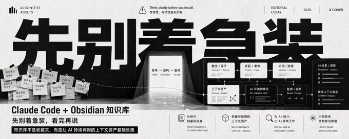
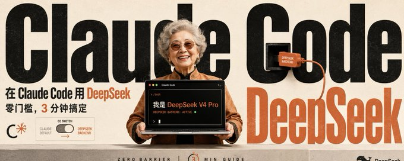
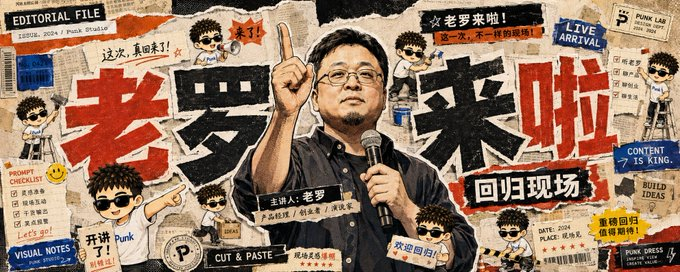
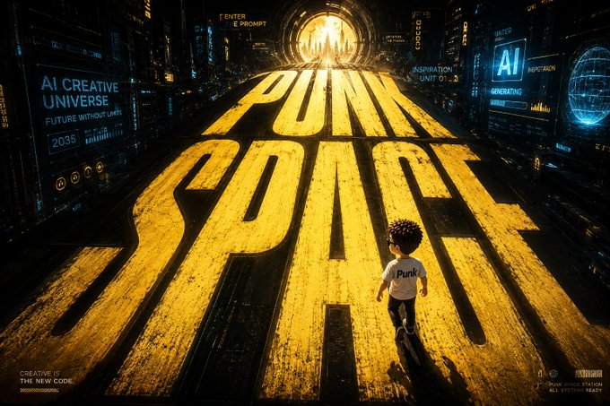
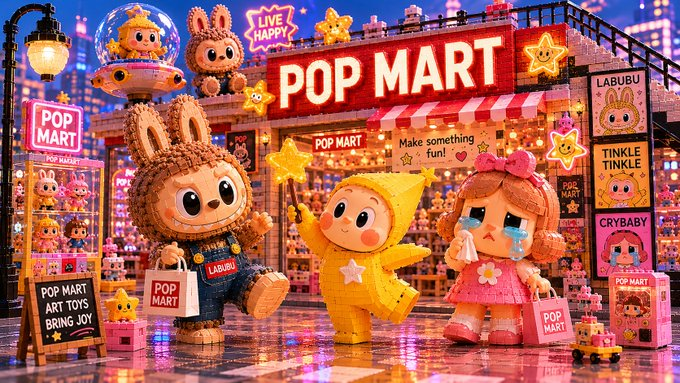
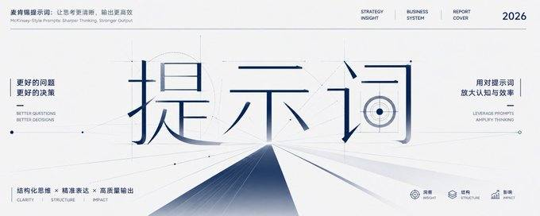
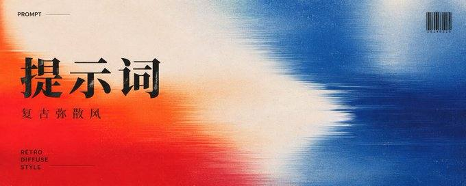
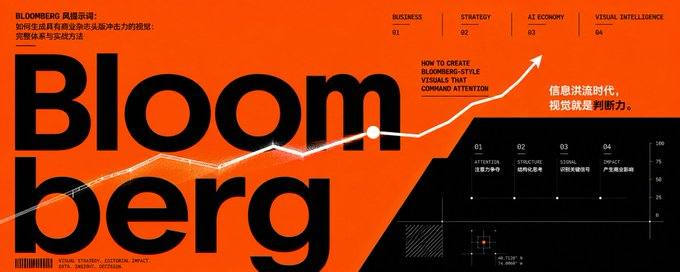
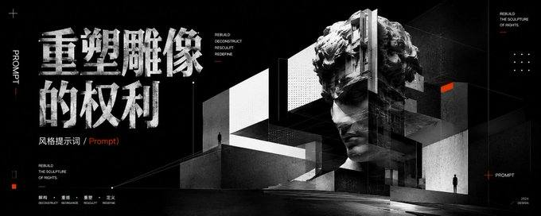

# Punk Skill

Punk Skill 是一组给 AI Agent 使用的实用 Skills，面向内容创作、视觉生成和发布工作流。

当前包含：

| 技能 | 用途 | 路径 |
| --- | --- | --- |
| `punk-cover` | 根据文章、笔记、公众号文章、X 推文或主题草稿生成封面图，并在环境支持时直接出图 | [`skills/punk-cover`](./skills/punk-cover) |
| `punk-avatar` | 根据人物、宠物、物品照片或文字描述生成头像图，并在环境支持时直接出图 | [`skills/punk-avatar`](./skills/punk-avatar) |

仓库同时提供顶层 [`styles/`](./styles) 原子库。每个 style 都包含：

- `STYLE.md`：风格元信息、输入类型、适用对象、输出类型、默认比例和来源。
- `PROMPT.md`：纯视觉风格提示词原子，只描述该 style 的视觉气质、构图、材质、字体和图文关系。

## 安装方式

把下面这段话发给支持 Skills 的 AI Agent，让它安装本项目里的全部 skills：

```text
请安装这个仓库里的全部 Skills：https://github.com/adrianpunk/Punk-Skill
```

## 可用技能

### punk-cover

`punk-cover` 是一个封面图生成 skill。它会先分析输入内容，再确认发布平台和视觉风格，最后从顶层 `styles/` 原子库选择 `outputs` 包含 `cover` 或 `poster` 的风格，生成完整图片提示词；如果当前环境有可用的图片生成工具，会继续生成封面图。

最终图片提示词采用“风格原子 + 封面形态蓝图”的编译结构：

1. `styles/{style-id}/PROMPT.md`：可复用的视觉风格原子，只描述该 style 的视觉气质、构图语言、材质、色彩、字体和图文关系。
2. `skills/punk-cover/references/cover-prompt-blueprint.md`：封面形态蓝图，负责平台比例、标题层级、长文提炼、传播性、封面构图、图文融合和单图输出规则。
3. `punk-cover`：把选定 style 原子编译进封面形态蓝图，生成一个完整封面提示词，而不是把任务层和风格层机械拼接。

旧版 `skills/punk-cover/references/templates/` 目录仍保留用于兼容外部引用，新运行不读取该目录。

适合：

- 小红书封面
- 微信公众号封面
- X / Twitter 头图
- 文章、教程、观点、产品分析、科研主题的封面图
- 只需要生成可复用图片提示词的场景

#### 使用示例

只给文章内容时，skill 会先询问平台，并推荐 3 个风格：

```text
Use $punk-cover to create a cover image for this article:

这里粘贴文章、笔记或主题草稿
```

指定平台和风格时，会直接进入提示词保存和图片生成：

```text
Use $punk-cover to create a WeChat public account cover in 商业杂志头版 style:

这里粘贴文章内容
```

指定自定义比例：

```text
Use $punk-cover to create a cover image, aspect ratio 16:9, style 黑白极简概念:

AI Agent 正在改变内容生产方式
```

只要提示词，不生成图片：

```text
Use $punk-cover to create prompt-only output for this X cover, style 黑白灰先锋几何:

这里粘贴推文或文章摘要
```

#### 工作流

1. 分析文章或主题，提炼标题、摘要、主视觉、受众、情绪、隐喻和禁用元素。
2. 确认发布平台或画幅比例。
3. 如果用户没有指定风格，基于内容推荐 3 个风格并说明理由。
4. 读取选定 style 的 `STYLE.md`、`PROMPT.md` 和 `cover-prompt-blueprint.md`，将 style 原子应用到封面形态上，编译成一个完整封面提示词。
5. 保存 `punk-assets/punk-cover/{slug}/prompts/cover.md`。
6. 如果环境支持图片生成，则继续生成封面；只有当图片工具为当前生成明确返回本地路径、可下载 URL 或图片二进制时，才保存为 `punk-assets/punk-cover/{slug}/cover.png`。不要通过扫描通用生成目录来猜测图片归属。

> 长文章不会被原样复制进输出文件。最终提示词只使用标题、摘要、视觉方向等派生信息。

#### 平台比例

| 平台 | 默认比例 |
| --- | --- |
| 小红书 | `3:4` |
| 微信公众号 | `2.35:1` |
| X / Twitter | `5:2` |
| 自定义 | 使用用户输入的比例 |

#### punk-cover 输出文件

| 文件 | 内容 |
| --- | --- |
| `punk-assets/punk-cover/{slug}/prompts/cover.md` | 完整可复用的最终图片提示词，由一个 style 原子和封面形态蓝图编译而成 |
| `punk-assets/punk-cover/{slug}/cover.png` | 图片工具提供可保存 artifact 时的封面图 |

## punk-cover 风格

`punk-cover` 默认可使用 11 个封面向 style。用户可以直接指定风格，也可以让 skill 根据内容推荐。

| 风格 | 适合内容 |
| --- | --- |
| 黑白极简概念 | 抽象观点、战略、哲学、批判性主题 |
| 语义转译极简 | 单词、短句、口号、概念转译 |
| 复古手撕拼贴 | 社交传播、文化议题、街头感、复古杂志感 |
| 方块世界 | 教程、工具、系统搭建、升级、游戏化表达 |
| 巨型透视中文标题 | 中文标题主导、强冲击、活动和社媒封面 |
| 积木世界 | 搭建、团队、计划、教育、亲子和系统隐喻 |
| 咨询报告视觉 | 商业策略、方法论、产品分析、结构化观点 |
| 科研期刊概念 | 科研、医学、材料、生物、机制类主题 |
| 复古弥散渐变 | 艺术、设计、品牌、情绪化文章和杂志封面 |
| 商业杂志头版 | AI、创业、投资、趋势、商业科技封面 |
| 黑白灰先锋几何 | 实验性、现代主义、几何构成、强对比视觉 |

这些封面 style 的视觉规则位于 `styles/{style-id}/PROMPT.md`，结构化风格锚点位于 `styles/{style-id}/STYLE.md`。`skills/punk-cover/references/style-catalog.md` 只维护可选菜单和路径引用，不再重复维护模板正文。

#### 维护检查

修改 `punk-cover` 或 cover/poster style 后，建议运行：

```sh
node scripts/validate-punk-cover.mjs
git diff --check
```

校验脚本会确认 cover/poster style 具备 `style_anchors`、`cover_shape_adaptation`、`must_preserve` 和 `avoid_when_applying_to_cover`，并确认 `punk-cover` 仍使用封面蓝图编译流程。

### punk-avatar

`punk-avatar` 是一个头像图生成 skill。它会优先根据图片识别主体特征，也支持纯文字描述生成虚构头像；如果用户没有指定风格，会根据主体类型推荐 2-3 个头像风格并等待选择。风格确认后，skill 会从顶层 `styles/` 原子库读取一个选定 style，生成完整头像提示词；如果当前环境有可用的图片生成工具，会继续生成头像图。

最终图片提示词采用“风格原子 + 头像形态蓝图”的编译结构：

1. `styles/{style-id}/PROMPT.md`：可复用的视觉风格原子。
2. `skills/punk-avatar/references/avatar-prompt-blueprint.md`：头像形态蓝图，负责主体识别、相似度策略、头像构图、裁切安全区、背景简化、用途和单图输出规则。
3. `punk-avatar`：把选定 style 原子编译进头像形态蓝图，生成一个完整头像提示词，而不是把任务层和风格层机械拼接。

适合：

- 人物头像
- 宠物头像和宠物纪念卡
- 物品或符号化头像
- 纯文字描述的虚构头像
- 只需要生成可复用头像提示词的场景

#### 使用示例

只给照片且不指定风格时，skill 会默认使用 `1:1`，并先推荐可用风格：

```text
Use $punk-avatar to create an avatar from this photo.
```

指定风格时，会直接进入提示词保存和图片生成：

```text
Use $punk-avatar to create a 像素头像 from this photo.
```

给宠物照片和名字：

```text
Use $punk-avatar to create a 拍立得纪念卡 for this pet. 宠物名：可乐。
```

指定自定义比例：

```text
Use $punk-avatar to create a 凌乱蜡笔宠物肖像, aspect ratio 4:5. 宠物名：奶茶。
```

纯文字描述头像：

```text
Use $punk-avatar to create a text-only 像素头像: a calm robot barista with a blue cap and square glasses.
```

#### 工作流

1. 分析图片或文字描述，识别主体类型、关键特征、用途、保留元素和禁用元素。
2. 默认画幅比例为 `1:1`；用户指定任意自定义比例时，保持用户比例。
3. 如果用户没有指定风格，基于主体类型推荐 2-3 个风格并等待选择。
4. 读取选定 style 的 `STYLE.md`、`PROMPT.md` 和 `avatar-prompt-blueprint.md`，将 style 原子应用到头像形态上，编译成一个完整头像提示词。
5. 保存 `punk-assets/punk-avatar/{slug}/prompts/avatar.md`。
6. 如果环境支持图片生成，则继续生成头像；只有当图片工具为当前生成明确返回本地路径、可下载 URL 或图片二进制时，才保存为 `punk-assets/punk-avatar/{slug}/avatar.png`。不要通过扫描通用生成目录来猜测图片归属。

> 没有图片时，`punk-avatar` 会按描述生成虚构头像，不承诺保留真人或宠物相似度。

#### punk-avatar 风格

`punk-avatar` 首版可使用 5 个头像相关 style。所有 style 在 `punk-avatar` 内默认比例都是 `1:1`；style metadata 里的 `default_ratio` 只作为风格原子参考。

| 风格 | Style ID | 对象 | 适合内容 |
| --- | --- | --- | --- |
| 像素头像 | `pixel-avatar` | 人、宠物、物品 | 标准头像、像素 IP、符号化头像 |
| 怪诞灵魂手绘 | `grotesque-soul-sketch` | 人、宠物 | 趣味头像、情绪化手绘肖像 |
| 凌乱蜡笔宠物肖像 | `messy-crayon-pet-portrait` | 宠物 | 宠物头像、宠物手绘肖像 |
| 时尚速写观察页 | `fashion-sketch-observation` | 人 | 人像头像、街拍和旅行观察页感肖像 |
| 拍立得纪念卡 | `polaroid-keepsake` | 宠物 | 宠物头像衍生卡片、宠物纪念图 |

#### punk-avatar 输出文件

| 文件 | 内容 |
| --- | --- |
| `punk-assets/punk-avatar/{slug}/prompts/avatar.md` | 完整可复用的最终图片提示词，由一个 style 原子和头像形态蓝图编译而成 |
| `punk-assets/punk-avatar/{slug}/avatar.png` | 图片工具提供可保存 artifact 时的头像图 |

#### 维护检查

修改 `punk-avatar` 或头像相关 style 后，建议运行：

```sh
node scripts/validate-punk-avatar.mjs
git diff --check
```

## Style 原子库

顶层 `styles/` 目前包含 16 个可复用视觉风格原子，其中 11 个可用于 `punk-cover`，5 个可用于 `punk-avatar`。

| Style ID | 输出 |
| --- | --- |
| `black-white-minimal-concept` | `cover`, `poster` |
| `semantic-minimal-translation` | `cover`, `poster` |
| `retro-torn-collage` | `cover`, `poster` |
| `block-world` | `cover`, `poster` |
| `giant-perspective-chinese-title` | `cover`, `poster` |
| `brick-world` | `cover`, `poster` |
| `consulting-report-visual` | `cover`, `poster`, `editorial_page` |
| `research-journal-concept` | `cover`, `poster`, `editorial_page` |
| `retro-diffuse-gradient` | `cover`, `poster` |
| `business-magazine-front-page` | `cover`, `poster`, `editorial_page` |
| `black-white-gray-avant-geometry` | `cover`, `poster` |
| `pixel-avatar` | `avatar` |
| `messy-crayon-pet-portrait` | `portrait` |
| `polaroid-keepsake` | `polaroid`, `portrait` |
| `fashion-sketch-observation` | `portrait`, `editorial_page` |
| `grotesque-soul-sketch` | `portrait` |

### 风格样例

| | | |
|:---:|:---:|:---:|
|  |  |  |
| 黑白极简概念 | 语义转译极简 | 复古手撕拼贴 |
|  |  |  |
| 方块世界 | 巨型透视中文标题 | 积木世界 |
|  |  |  |
| 咨询报告视觉 | 科研期刊概念 | 复古弥散渐变 |
|  |  | |
| 商业杂志头版 | 黑白灰先锋几何 | |

## 仓库结构

```text
.
├── README.md
├── screenshots/
│   └── punk-cover-styles/
├── styles/
│   └── {style-id}/
│       ├── STYLE.md
│       └── PROMPT.md
└── skills/
    ├── punk-cover/
    │   ├── SKILL.md
    │   ├── agents/openai.yaml
    │   └── references/
    │       ├── cover-prompt-blueprint.md
    │       ├── style-catalog.md
    │       └── templates/
    └── punk-avatar/
        ├── SKILL.md
        ├── agents/openai.yaml
        └── references/
            ├── avatar-prompt-blueprint.md
            └── style-catalog.md
```

`skills/punk-cover/references/templates/` 是旧版兼容目录，新运行应优先使用顶层 `styles/`。
